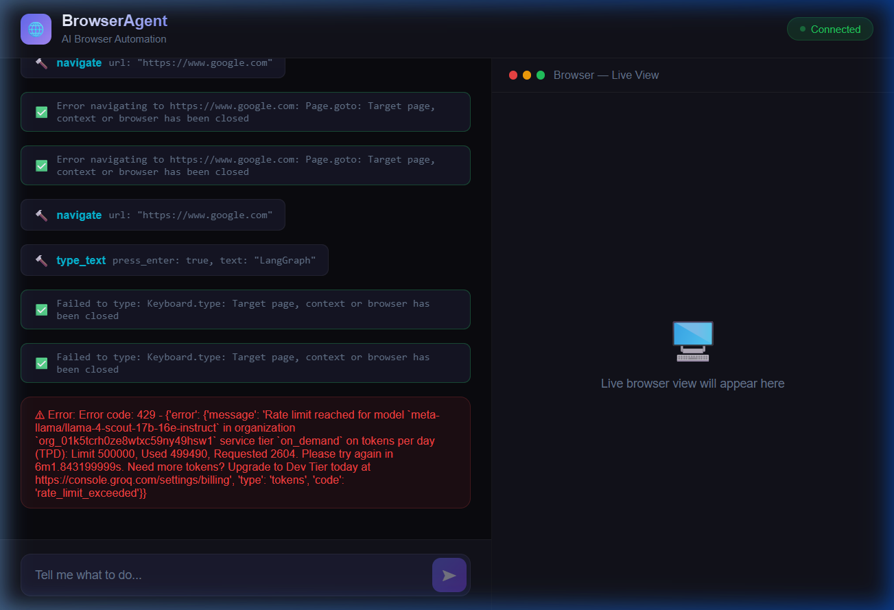

# Surf AI - AI Browser Automation 🌐

Surf AI is a powerful browser automation agent built with **LangGraph** and **Vision-capable LLMs** (via Groq). It allows you to control a web browser using natural language, seeing the screen just like a human does.



## Features 🚀

- **Vision-Based Navigation**: The agent "sees" the screen using screenshots to interact with elements accurately.
- **Natural Language Control**: Tell the agent what to do (e.g., "Search for LangGraph on Google") and watch it work.
- **Real-Time Live View**: Watch the browser's actions in real-time through the React-based dashboard.
- **Cross-Platform Ready**: Optimized for deployment on platforms like Railway (Backend) and Vercel/Netlify (Frontend).

## Project Structure 📂

- `client/`: Modern Vite + React frontend dashboard.
- `src/`: Core agent logic, tools, and browser management.
- `server.py`: FastAPI backend with WebSocket support for real-time streaming.
- `Dockerfile`: Production-ready container configuration.

## Setup & Installation 🛠️

### 1. Backend Setup
1. Clone the repository.
2. Install dependencies:
   ```bash
   uv sync
   ```
3. Create a `.env` file with your API keys:
   ```env
   GROQ_API_KEY=your_key_here
   MODEL=meta-llama/llama-4-scout-17b-16e-instruct
   ALLOWED_ORIGINS=http://localhost:5173
   ```
4. Start the server:
   ```bash
   uv run python server.py
   ```

### 2. Frontend Setup
1. Navigate to the client directory:
   ```bash
   cd client
   ```
2. Install dependencies:
   ```bash
   npm install
   ```
3. (Optional) Set your backend URL in `.env`:
   ```env
   VITE_WS_BACKEND_URL=localhost:8000
   ```
4. Start the dev server:
   ```bash
   npm run dev
   ```

## Deployment 🚢

### Backend (Railway)
1. Link your GitHub repo to Railway.
2. Railway will automatically detect the `Dockerfile`.
3. Add your `GROQ_API_KEY` and other variables in the Railway dashboard.

### Frontend
1. Deploy the `client/` folder to any static hosting service.
2. Ensure you set `VITE_WS_BACKEND_URL` to your live backend domain.

## License 📜
MIT
